# Updates

[22/11/2023] Accepted to ICBiomed2023 journal  

<a href="https://drive.google.com/file/d/1C6cF6OIHhKKlpEKiK8Sw943IYeUSPAJC/view">pdf paper link</a>

# Improving U-Net Performance for Low-Grade Glioma MRI Image Segmentation by Modification of U-Net Concatenations

<b>Ziheng Su</b>

Hajim School of Engineering and Applied Sciences  
University of Rochester  
Rochester, 14627, USA  
zsu8@u.rochester.edu

<b>Tario You</b>

Shanghai American School Pudong  
Shanghai, 201201, China  
tario01pd2024@saschina.org

# Abstract

Recent developments in deep learning techniques applied to lower-grade glioma (LGG) MRI image segmentation have created accurate models comparable to human professionals. Among these deep learning models, the u-net proposed by Buda et al. performs best among other model architectures. However, we doubt that u-net reaches its full potential. In this paper, we validate whether u-net has the maximum performance possible: we modify the number and direction of concatenation operations in u-net to see whether modified architectures perform better than the original u-net in terms of accuracy, measured by dice coefficients. Our results show 1) the original u-net model is not optimal since all modified models perform better than the original one, 2) positive and likely logarithmic correlation between concatenation complexity and model performance, and 3) unknown relation between concatenation direction and model performance. The reason for the logarithmic part of the correlation in 2) and the unknown correlation in 3) requires further investigation with more theories.

# 1. Introduction

## 1.1. MRI Image Segmentation of Low-Grade Gliomas (LGG)

Low-grade gliomas are brain tumors characterized by their slow growth. However, if left untreated, they develop into high-grade gliomas, which grow faster and are more dangerous: “Glioblastoma (GMB) is one of the most complex, deadly, and treatment-resistant cancers” [1,2]. In 2020, around 380,000 people were diagnosed with a central nervous system tumor, 85% of which are brain tumors [3]; 33% of all brain tumors are gliomas [6].

One technique of imaging LGG lesions is magnetic resonance imaging (MRI) [15]. MRI creates detailed images using a magnetic field and radio waves [9]: the magnetic field can “temporarily [realign] water molecules in your body,” and then the radio waves and the machine capture the realignment to create an MRI image [9]. Since MRI can display entire tissues on MRI images, invasive surgery is no longer required for glioma diagnosis, which is a huge advantage. Since MRI images also have the advantages of “high sensitivity, moderate specificity, and high diagnostic performance in detection of intra-axial gliomas,” [10] we choose MRI images as our focus.[9]

Image segmentation is the process of separating tumor regions from the rest of the image by computational methods, such as sketching a closed line encircling the tumor region directly on the original image [4]. Many papers propose deep learning techniques [4, 5, 11] to automate image segmentation. Researchers train the models with the original grayscale image against ground truth mask images, or images containing full-black background where only the lesion area is white. Since deep learning models learn how to determine the boundaries of glioma by themselves and data only, such non-invasive and highly-efficient methods automate glioma diagnosis. Thus our research scope is set to deep learning’s application to glioma image segmentation. Our work will be focusing on maximizing the performance of deep learning models that are used in glioma image segmentation in order to best assist glioma diagnosis.

## 1.2. U-Net and its Model Architecture

Unique to other deep learning architectures for image segmentation, u-net focuses on learning discriminative features at different stages rather than focusing solely on the end output [7]. U-net is most optimal for biomedical image segmentation among all other techniques [11, 16]: Brox et al. train this model with fewer training images yet yields more precise segmentation results [11]. We thus narrow our scope of chosen deep learning models to u-nets.

A U-net model consists of a contracting path and an expansive path, creating the u-shaped architecture [13] whose schematic diagram is shown in Figure 1 below. The contracting path is a typical convolutional network, “the most successful type of models for image analysis to date”, consisting of multiple convolutions (abbreviated as Conv, which contains parameters for the model to learn during training), rectified linear units (abbreviated as ReLU, which is an energy-efficient activation function), and max pooling operations (reduces the dimensions of the incoming image data) [13, 8]. The contracting path reduces spatial information while increasing feature information [13]. Meanwhile, the expansive pathway extrapolates the feature information to a larger resolution using similar convolutional and ReLU layers [13]. Additionally, concatenations between the contracting and expanding paths help the model learn features at different resolutions [13, 7].

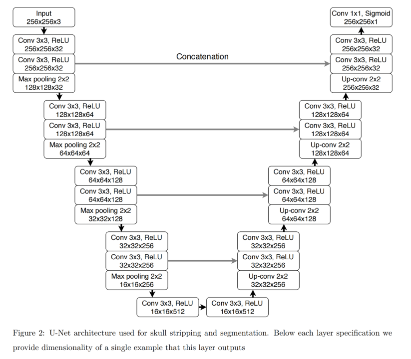  <b>Figure 1: Schematic of U-Net architecture. Code: https://github.com/MaciejMazurowski/brain-segmentation</b>

Although the u-net model architecture proposed by Brox et al. [11] does pose maximum performance compared with other architectures, the paper does not discuss the existence of model architectures that perform even better than u-nets. We doubt whether the u-net architecture proposed by Brox et al. reaches its maximum potential or not. Specifically, we wonder whether such concatenation operations indicated as horizontal gray arrows in Figure 1, ensure u-net’s optimal model performance or not. Thus our work will be to try to answer this question by modifying the direction and number of concatenation operations. We will train both the original and the modified models with the same dataset. If the modified architectures do indeed raise performance, we could conclude that the original u-net architecture is not optimal. If the performances do not raise or even drop, then the original U-net would indeed be optimal.

In this paper, section 1 introduces background concepts including glioma and u-net. Section 2 of this paper will introduce our methods to train the models, including the source of our dataset, our evaluation metric, and how concatenation operations are modified. Section 3 will 1) check whether modified architectures are indeed better than the original u-net architecture, 2) identify and explain the correlation between the number of concatenation operations and model performance, and 3) identify and explain the correlation between concatenation directions and model performance. Section 4 will give our research’s limitations that can be used for future research.

# 2. Methods

## 2.1. Raw Data

We choose our raw data from the Cancer Imaging Archive (TCIA-LGG), which contains 110 patients’ brain MRI images. The 110 patients of the TCIA-LGG dataset constitute a total of 3929 images and 3929 masks. Each patient corresponds to a set of multiple images representing a slice of the MRI image, as multiple 2-D images are needed to express the scanned 3-D space of brains. Each image is 256x256 in resolution and has three channels. Each mask image has only black and white pixels, with the white area serving as the location of the LGG on the original image. The whole dataset is divided into train, validate, and test subsets with an 80%, 10%, and 10% ratio in terms of the number of patients.

## 2.2. Evaluation Metric

We choose our evaluation metric for u-net model performance as dice coefficients, one of the most widespread metrics for model performance for image segmentation tasks. Calculation of the model involves comparing two arbitrary images, where the formula is shown below in Figure 2. Since we can substitute the two arbitrary areas in the dice coefficient’s formula as the prediction masks and ground truth masks, where ground truth refers to masks images containing known correct glioma locations, and prediction refers to masks images predicted, or generated by the u-net models, dice coefficients calculate the normalized overlap between ground truth masks and prediction masks. Therefore, a high dice score (DSC) performance indicates high overlap, which indicates high model accuracy. A low dice score thus indicates low model accuracy. Therefore, DSC is a direct, quantified indication of model performance [12]. Thus in the model’s training, validation, and testing process, we use dice coefficients to display model performance on train, validation, and test datasets. In the results section of this paper, dice coefficients will thus appear in three series in tables and graphs: train DSC, validate DSC, and test DSC.

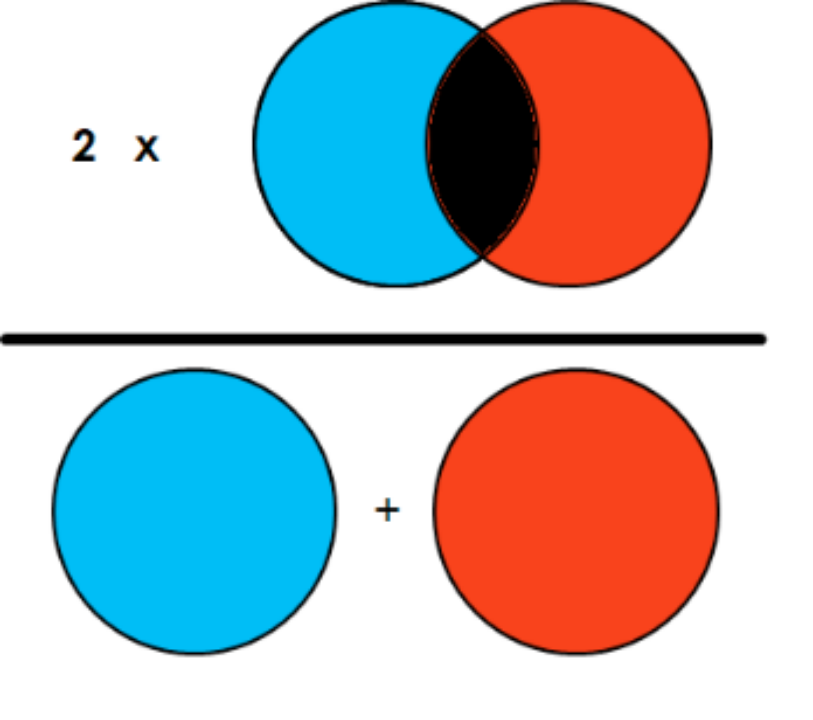 <b>Figure 2: Dice coefficient formula [14]. The blue and red circles refer to two arbitrary areas respectively. The numerator is two times the area of overlapping area between red and blue areas. The denominator is the sum of sizes, or number of pixels, of red and blue areas.</b>

## 2.3. Model Architectures

### 2.3.1. Original U-Net Architecture

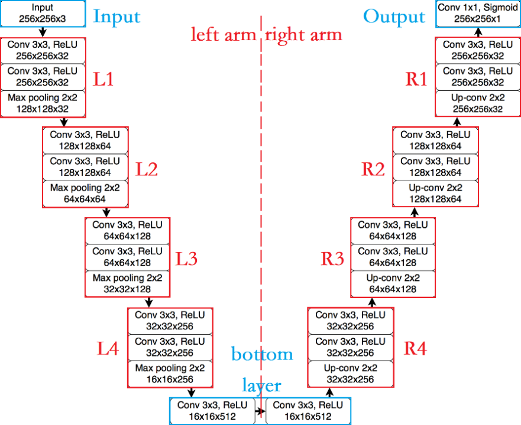 <b>Figure 3 - schematic of the u-net without any concatenation with labels</b>

In order to describe the input and output of concatenation operations clearly, we take the original u-net model architecture that is shown in Figure 1 and label the non-concatenation components of u-net (convolution, deconvolution, max-pooling, and upsampling layers) such that we can refer to these components easier. Each box in Figure 3 represents one of such layers, and each series of three boxes labeled in red represents a “unit”. The blue units are layers irrelevant to our consideration as they do not participate in concatenation operations. All units on the left constitute the left arm; all units on the right constitute the right arm. The three numbers on the second line of each black box represent the input image’s width, height, and amount. The height and width constitute the image resolution of this layer and the whole unit since the images have a constant resolution in each unit.

The figure assigns a label to each unit: the letter ‘L’ indicates the left arm, and ‘R’ indicates the right arm. Since each unit has half the resolution as the unit above it, we can assign numbering to each level of resolution. In figure 3, resolution 256x256 corresponds to layer 1, 128x128 to layer2, 64x64 to layer3, and 32x32 to layer 5.

The red color indicates all possible starting and ending locations for concatenations. Each concatenation operation starts from one of the four units of the left arm to one of the four units on the right arm. We can now describe inputs and outputs of concatenation operations as left arm label to right arm label. For example, L1 to R3 represents that the output of the L1 unit is concatenated with the output of the R4 unit and together sent as the R3 unit’s input.

### 2.3.2. Modified U-Net Architecture

By enumerating different positions and amounts of concatenations, we produced multiple new U-net architectures. Figure 4 shows all of such original and modified u-nets we will use.

| a                                  | b                                  | c                                  | d                                  |
| ---------------------------------- | ---------------------------------- | ---------------------------------- | ---------------------------------- |
| 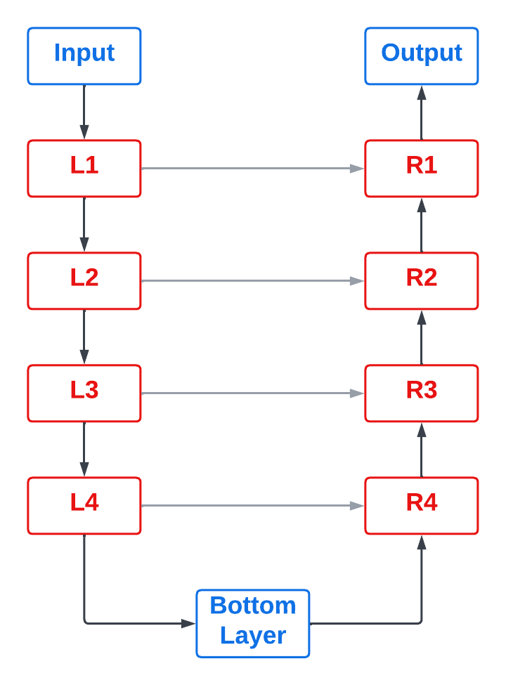 | 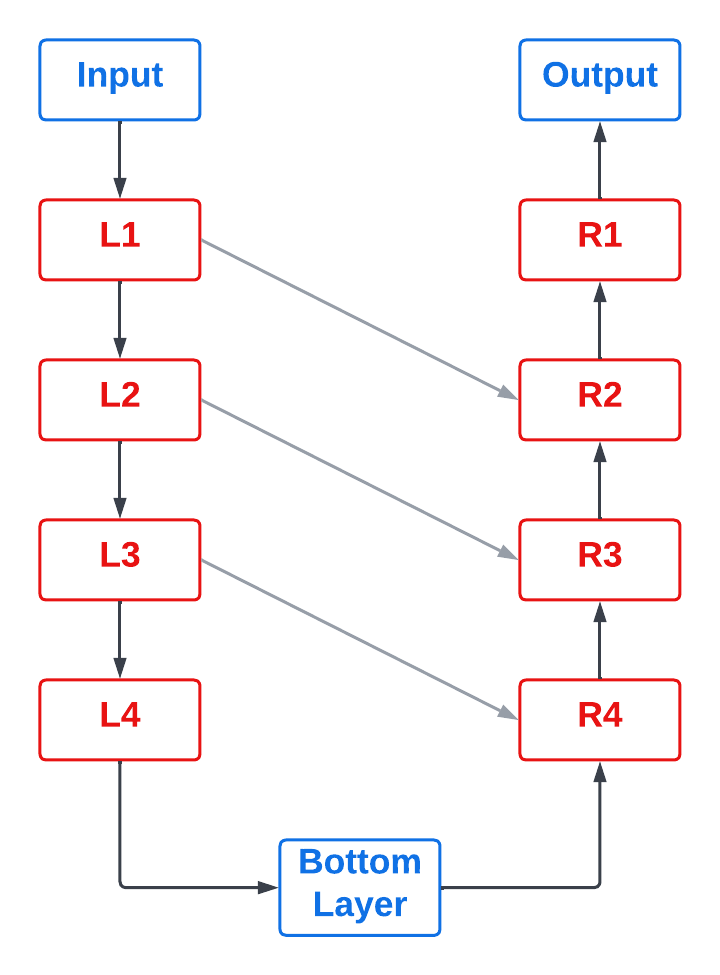 | 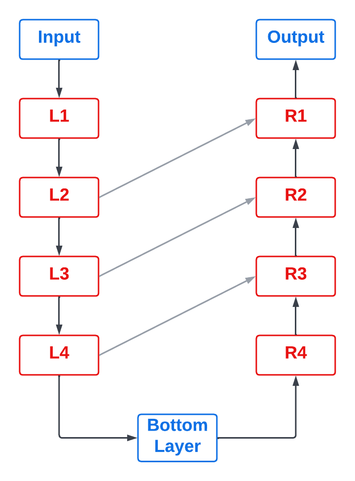 | 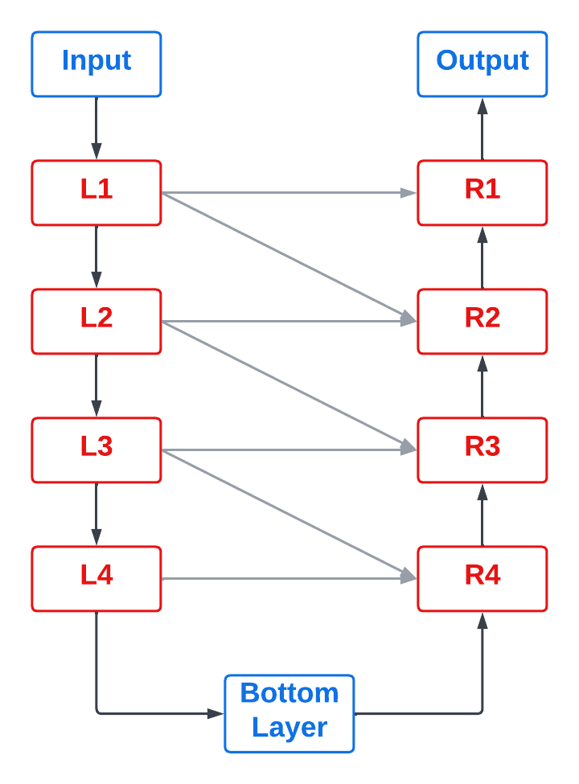 |

| e                                  | f                                  | g                                   |
| ---------------------------------- | ---------------------------------- | ----------------------------------- |
| 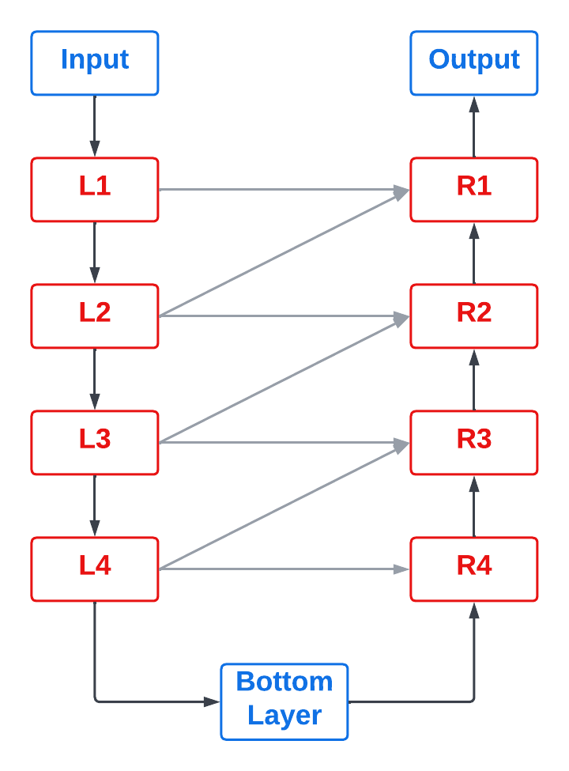 | 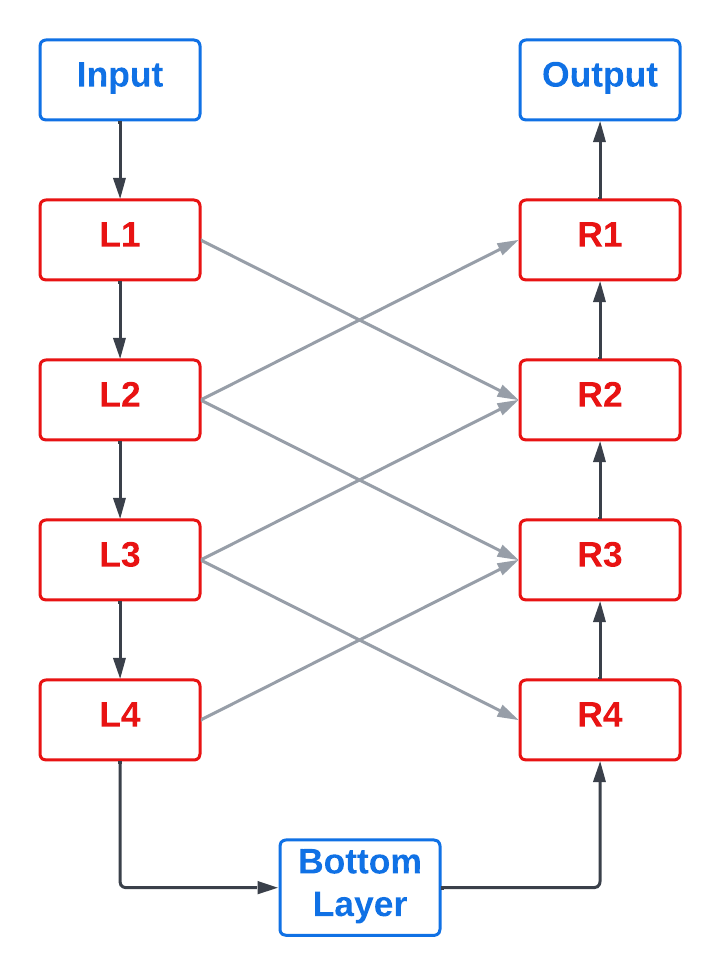 | 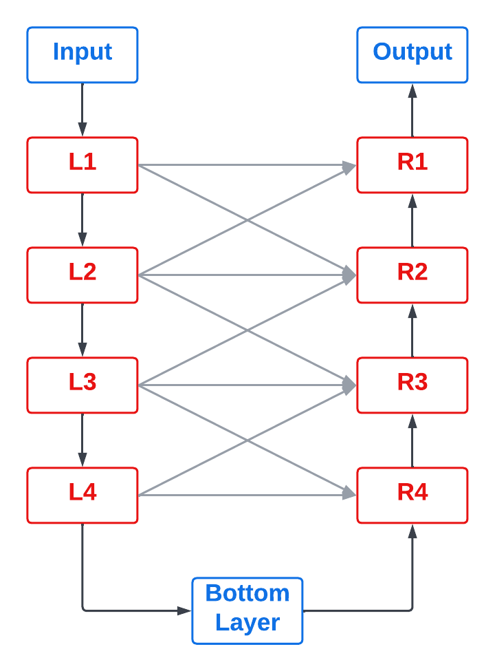 |

<b>Figure 4 - From top left to bottom right: simplified schematic of all seven modified models’ concatenation directions (a) flat, (b) down, (c) up, (d) flat+down, (e) flat+up, (f) down+up, and (g) flat+down+up.</b>

Figure 4 shows simplified schematic diagrams of all modified u-nets, with Figure 4a indicates the original architecture. Each gray arrow indicates the starting and ending locations of one concatenation operation. Note that only red units participate in concatenation operations, and that all concatenations take left arm units as inputs and right arm units as outputs, not the reverse.

We define three basic concatenation directions seen in 4a, 4b, and 4c as flat, down, and up. Figures 4a, 4b and 4c are assigned one concatenation direction, indicated as one set of arrows in figures 4a, 4b, and 4c. In figure 4b, units L4 and R1 do not participate in concatenation, because any concatenation operation that has unit L4 as input or has unit R1 as output has direction that is not down, which creates inconsistency in concatenation directions. So such concatenations should not exist, hence units L4 and R1 have no arrows in figure 4b. Units L1 and R4 in figure 4c also don’t have concatenations due to similar reasons.

Figures 4d, 4e, 4f are assigned two directions, which can be seen as combinations of any two directions in figures 4a, 4b, and 4c. Figure 4d is the combination of flat and down directions or the combination of models in Figures 4a and 4b. Each left arm unit concatenates to right arm units having the same level and one level below. Figure 4e is the combination of flat and up directions or that of figures 4a and 4c. Figure 4f is the combination of down and up, or that of figures 4b and 4c. Figure 4g is assigned three directions: flat, down, and up, or combination of figures 4a, 4b, and 4c.

We observed that not only does the direction of concatenations differ between the models, but the number of concatenations is also different. Therefore, we define the metric "concatenation complexity" as the maximum number of received concatenations for a right arm unit in a specific model. For example, all right arm units in models in figures 4a, 4b, and 4c have a maximum of 1 concatenation received, indicated by at most one gray arrow pointed to each right arm unit, so models in figures 4a, 4b, and 4c have concatenation complexity 1. Table 1 below shows the concatenation complexity of each model.

<b>Table 1 - Model no. and concatenation complexity assigned to figure 4's subfigures</b>

| subfigure no. | model no. | concatenation complexity |
| ------------- | --------- | ------------------------ |
| a             | 1         | 1                        |
| b             | 2         | 1                        |
| c             | 3         | 1                        |
| d             | 4         | 2                        |
| e             | 5         | 2                        |
| f             | 6         | 2                        |
| g             | 7         | 3                        |

# 3. Results and Discussions

## 3.1. Model Performance Comparison

Figure 5 below shows the dice coefficients (DSC) of our training, validation, and testing. The specific numerical values are in Table 2.

<b>Table 2 - Train, validate, and test dice coefficients by model no.</b>

| model no. | DSC - train | DSC - validate | DSC - test |
| --------- | ----------- | -------------- | ---------- |
| 1         | 46.57%      | 60.89%         | 68.93%     |
| 2         | 72.67%      | 74.29%         | 80.65%     |
| 3         | 70.49%      | 69.25%         | 79.45%     |
| 4         | 72.81%      | 73.19%         | 82.05%     |
| 5         | 73.95%      | 72.49%         | 82.58%     |
| 6         | 76.60%      | 74.63%         | 82.31%     |
| 7         | 77.04%      | 73.66%         | 83.83%     |

| a                                   | b                                   |
| ----------------------------------- | ----------------------------------- |
| 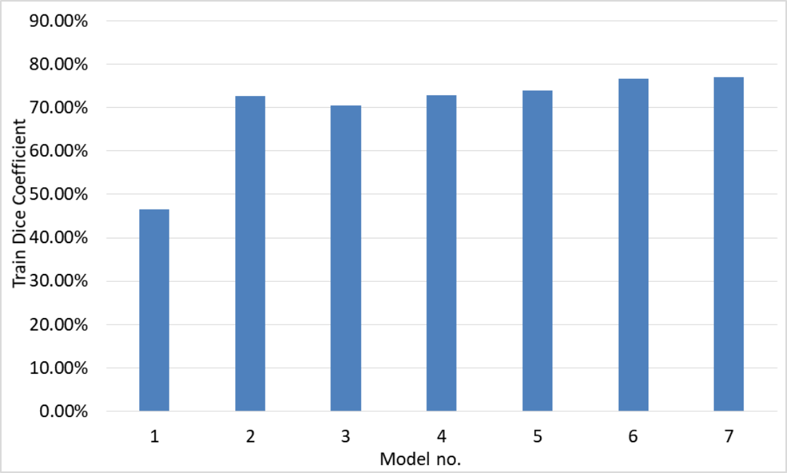 | 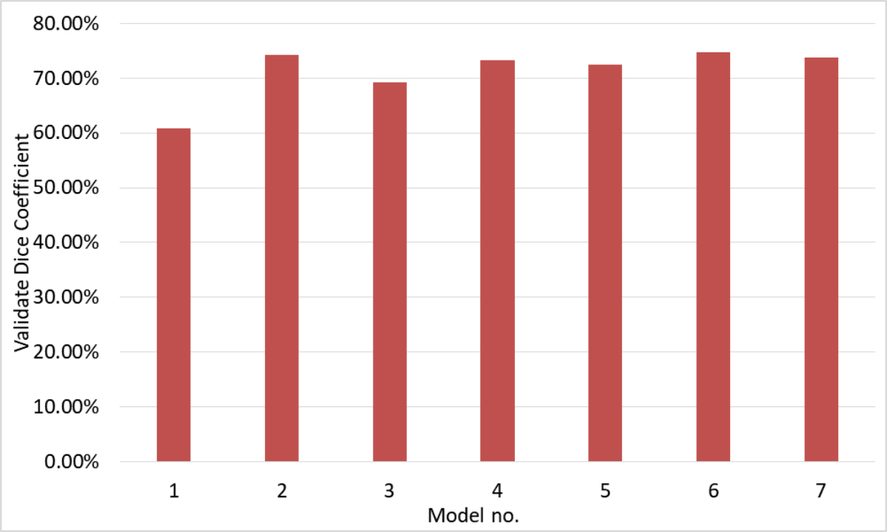 |

| c                                   |
| ----------------------------------- |
| 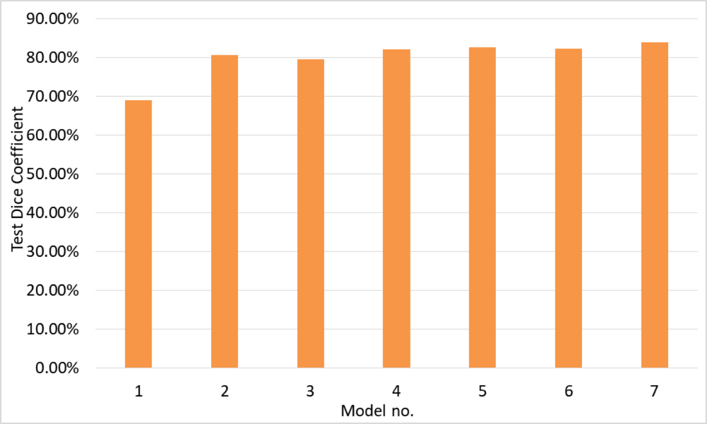 |

<b>Figure 5 - Distribution of (a) train, (b) validate, and (c) test dice coefficient over model no.</b>

We arranged the training DSCs in Figure 5a in descending order: model 7, 6, 5, 4, 2, 3, and 1; the validation DSCs in Figure 5b have the order: model 6, 2, 7, 4, 5, 3, 1; the test DSC in figure 5c has the order: model 7, 5, 6, 4, 2, 3, 1.

From the ranks above, the overall DSC for model 7 is the highest, being the maximum in train and test DSCs and the second maximum in validation DSC. The overall DSC for model 6 is the second highest, being maximum in train DSC and the second in validation and test DSCs. Finally, model 1 has the minimum overall DSC since it is the minimum in the train, validate, and test DSCs.

Since the seven models include model 1, the original model, and our goal is to maximize model performance, we are more interested in the relative improvement of DSC from model 1 than the absolute DSC. So we can compare the DSCs of all other models versus model 1 to see the relative DSC increase. Table 3 below shows each model's relative comparison in performance to model 1.

<b>Table 3 - Train, validate, and test percentage dice coefficients increase by model no. compared to model #1</b>

| model no. | train  | validate | test   |
| --------- | ------ | -------- | ------ |
| 1         | 0.00%  | 0.00%    | 0.00%  |
| 2         | 56.04% | 22.01%   | 17.01% |
| 3         | 51.36% | 13.72%   | 15.26% |
| 4         | 56.36% | 20.19%   | 19.03% |
| 5         | 58.79% | 19.05%   | 19.80% |
| 6         | 64.49% | 22.56%   | 19.40% |
| 7         | 65.43% | 20.97%   | 21.62% |

We arranged the training percentages DSCs in table 3 in the following descending order: model 7, 6, 5, 4, 2, 3, and 1; validation percentages have the order: model 6, 2, 7, 4, 5, 3, and 1; test percentages have the order: model 7, 5, 6, 4, 2, 3, and 1. The orders of percentage DSCs increase are the same as the order of absolute DSCs. So the models having the highest, second highest, and minimum DSCs are still model 7, model 6, and model 1, respectively.

Models 7 and 6 have the best and second best performance due to maximum and second maximum DSCs. Since model 1 is the original paper’s model and has the worst performance due to the lowest DSC, all modified models are better than the original u-net model. Therefore the changes in concatenation directions do raise model performance. <b>Therefore, our first conclusion is that the original u-net model architecture doesn’t have optimal performance, as our proposed modified u-net architecture has better performance.</b>

We proved that the correlations between modification of concatenation and increase in model performance do exist. Now we need to find the specific correlation. We compared variables affecting model architectures instead of comparing models directly. We analyze the two variables, concatenation complexity, and concatenation direction, in sub-sections 2 and 3 of this discussion section.

## 3.2. Concatenation Complexity Analysis

In order to see the correlation between DSCs and concatenation complexities, we need to first calculate average DSCs for all concatenation complexities. This is done by grouping different models having the same complexities together and calculating the average of all models’ DSCs within each group. Table 4 and Figure 7 below show DSCs against concatenation complexity.

<b>Table 4 - Train, validate, and test mean dice coefficients by concatenation complexity</b>

| concatenation complexity | train  | validate | test   |
| ------------------------ | ------ | -------- | ------ |
| 1                        | 63.24% | 68.14%   | 76.34% |
| 2                        | 74.45% | 73.44%   | 82.31% |
| 3                        | 77.04% | 73.66%   | 83.83% |

| a                                   | b                                   |
| ----------------------------------- | ----------------------------------- |
| 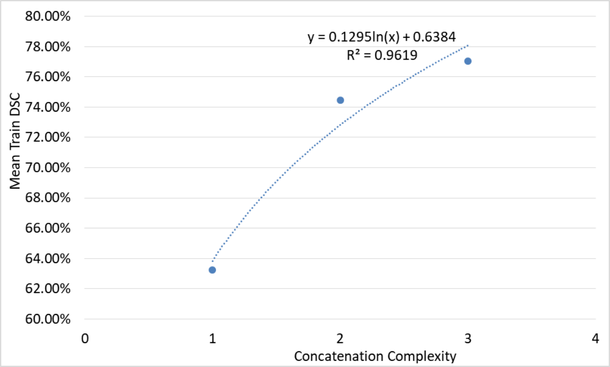 | 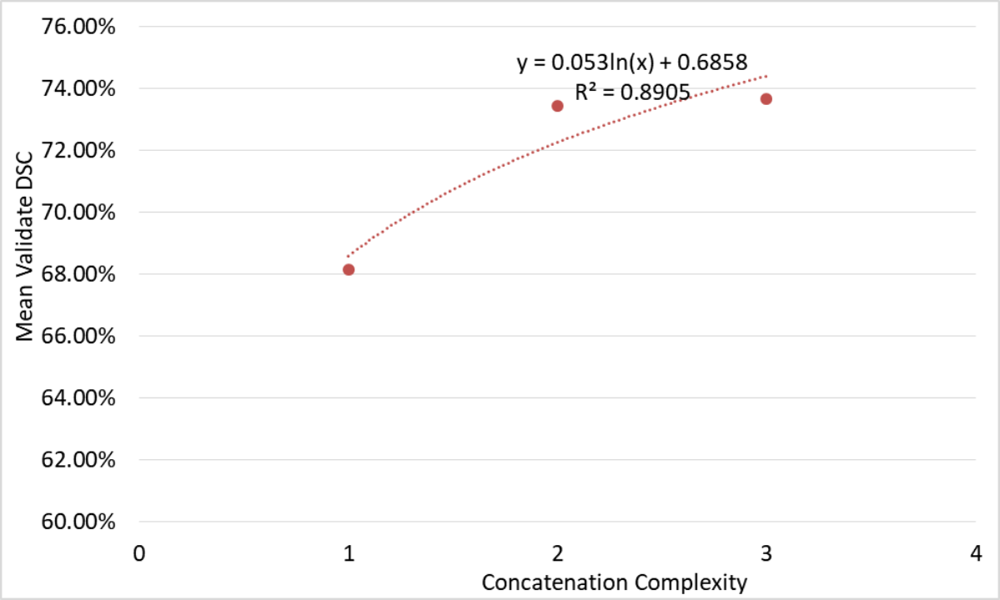 |

| c                                   |
| ----------------------------------- |
| 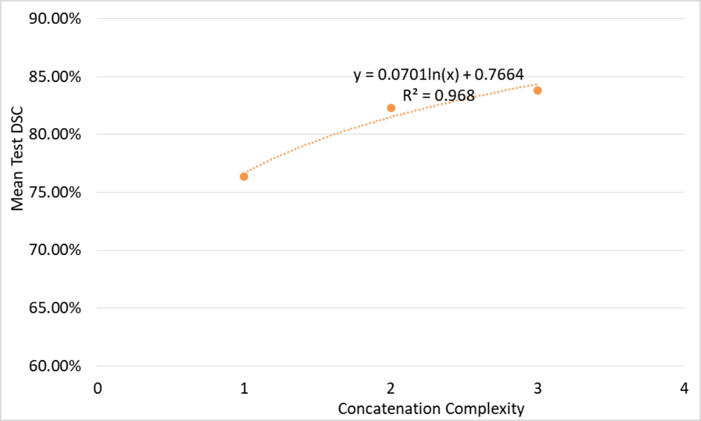 |

<b>Figure 6 - Relationship between (a) train, (b) validate, and (c) test mean dice coefficient and concatenation complexity, with formulas and coefficient of determinations for the logarithmic fit of each subfigure</b>

All DSCs in figure 6’s subfigures follow the same positive correlation, meaning that the average performance increases as the complexity increases. Moreover, complexity 2 is between 1 and 3 but closer to 3 than 1. Therefore, these positive correlations are not linear but increase slower as complexity rises. We can thus use logarithmic fitting to approximate the trends of Figures 6a, 6b, and 6c. Such fits are also very accurate, as the three coefficients of determination are all above 0.8.

<b>We can thus propose a second conclusion: the model performance has a positive correlation with model concatenation complexity, and such correlation is likely to be logarithmic.</b> We speculated below on the reason for the correlation being positive and likely logarithmic respectively.

The reason for the positive correlation may be the following. The increased complexity means more concatenations and the units in the U-net have more sources to learn from. This leads to more concatenation from left-arm units from more levels with different resolutions, which helps the u-net learn more levels of feature abstraction. The increased concatenations mean the u-net model can get a more holistic comprehension of the image during learning, which eventually leads to higher performance.

The reason for the logarithmic trend may be the increased difficulty of learning since the left side feeds more data into the right-arm units. Since we only conclude the logarithmic trend from a statistical view instead of excluding the possibility of non-logarithmic trends logically, this logarithmic part requires more investigation in the future.

## 3.3. Concatenation Direction Analysis

In order to see the correlation between DSCs and concatenation complexities, we need to calculate the impact of concatenation directions on model performance one direction at a time for all directions. This is done by grouping different models having the same direction of investigation together, and calculating the average of all models’ average normalized DSC within each group. To calculate the average normalized DSC of one group, we first identify which direction we want to investigate (denoted as D). Then we select a model (denoted as A) that contains direction D and select another model (denoted as B) that has the same way of concatenation but direction D is missing. Then we can find the normalized DSC increase from B to A, and find the average of normalized increases of direction D among all possible permutations of models A and B among the seven models.

For example, we can calculate the impact of the flat direction by the following steps:

1. Subtract the DSC of model 2 from that of model 4, and divide the difference by the DSC of model 2.
2. Subtract the DSC of model 3 from that of model 5, and divide the difference by the DSC of model 3.
3. Subtract the DSC of model 6 from that of model 7, and divide the difference by the DSC of model 6.
4. Find the average of all results in the previous steps

After such calculations in all directions, we can compile a table. Table 5 and Figure 7 below show the results.

<b>Table 5 - Train, validate, and test percentage dice coefficients increase by concatenation directions</b>

| concatenation complexity | train  | validate | test  |
| ------------------------ | ------ | -------- | ----- |
| flat                     | 1.89%  | 0.63%    | 2.51% |
| down                     | 23.07% | 9.86%    | 8.05% |
| up                       | 23.34% | 6.72%    | 8.01% |

| a                                   | b                                   |
| ----------------------------------- | ----------------------------------- |
| 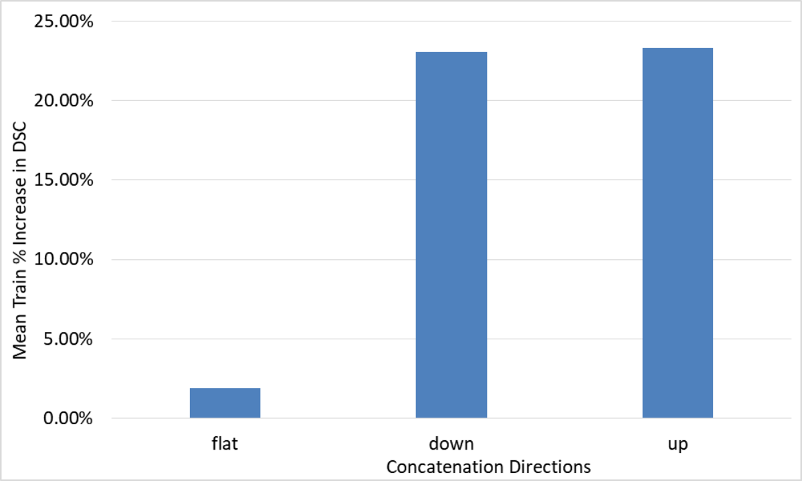 | 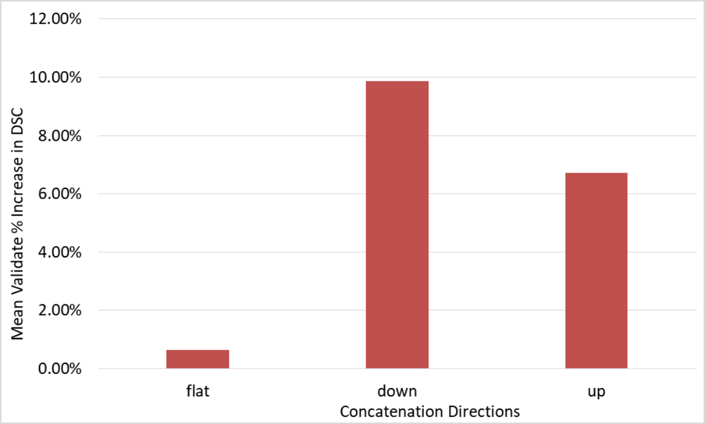 |

| c                                   |
| ----------------------------------- |
| 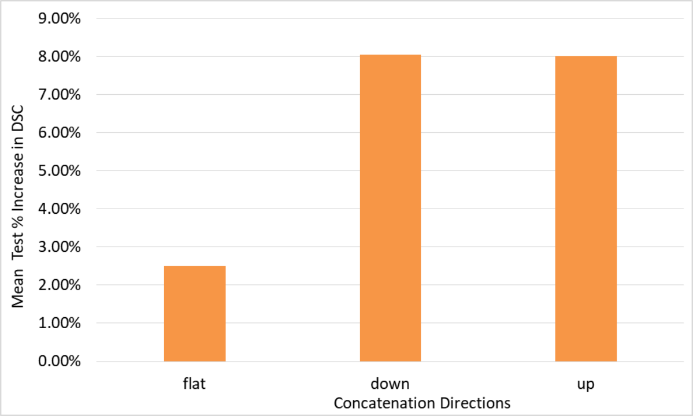 |

<b>Figure 7 - Distribution of mean (a) train, (b) validate, and (c) test percentage increase in dice coefficient over concatenation directions</b>

All subfigures of figure 7 show that all directions have positive values, and the flat direction has the minimum increase. The former shows that concatenations increase the model performance, and the latter shows that the down and up directions increase more than the flat direction. Thus, changing the concatenation directions from flat to other directions, such as changing the all-flat original model to other models with up and down directions, increases the model’s performance.

We can also observe that the train and test DSC increase of up and down directions are very close, and the validation DSC increase of the down direction is more significant than that of the up direction. So the DSC increase for down and up seems not to have significant differences. Plus, a limitation is that the very definition of concatenation direction is not quantified. <b>Thus, our third conclusion is that the specific influence of concatenation directions on model performance is still uncertain and needs further investigation.</b>

# 4. Conclusion

This paper focus on the modification of concatenation operations’ direction and complexity on the u-net deep learning model architecture with the goal of improving model performance. After conducting several experiments, we can make the following conclusions:

1. The original u-net model proposed by Buda et al. [4] still has room for optimization since all modified models perform better (larger dice coefficients) than the original one.
2. The concatenation complexities and model performance exhibits a positive and likely logarithmic correlation.
3. Unsure correlation between the concatenation directions and model performance.

One of our future goals is to quantify concatenation directions more. There is little mathematical basis for defining the directions as “flat,” “down,” and “up.” A future direction is to apply more theories to the current research about a quantified definition of cross-resolution-level (non-“flat”) concatenations.

Another future goal is to experiment more with concatenation complexity. We can only prove why the correlations are logarithmic from a statistical approximation perspective instead of a logical perspective. We choose logarithmic fits simply because it fits accurately with the correlation (coefficients of determination larger than 0.8). More experiments on concatenation complexity levels are needed to show the details and limits of the logarithmic trends. In addition, more theories about the principles of u-net’s units learning images with different resolutions need to be found as well in order to figure out the reasons behind the logarithmic trends.

# References

1. About glioblastoma. (n.d.). National Brain Tumor Society. Retrieved August 24, 2022, from https://braintumor.org/take-action/about-gbm/
2. Are all gliomas malignant? (n.d.). Moffitt Cancer Center. Retrieved September 6, 2022, from https://moffitt.org/cancers/brain-cancer/faqs/are-all-gliomas-malignant/
3. Brain tumor: Statistics. (2022, February). Cancer.Net. Retrieved August 18, 2022, from https://www.cancer.net/cancer-types/brain-tumor/statistics
4. Buda, M., Saha, A., & Mazurowski, M. A. (2019). Association of genomic subtypes of lower-grade gliomas with shape features automatically extracted by a deep learning algorithm. Computers in Biology and Medicine, 109, 218-225. https://doi.org/10.1016/j.compbiomed.2019.05.002
5. Chang, K., Bai, H. X., Zhou, H., Su, C., Bi, W. L., Agbodza, E., Kavouridis, V. K., Senders, J. T., Boaro, A., Beers, A., Zhang, B., Capellini, A., Liao, W., Shen, Q., Li, X., Xiao, B., Cryan, J., Ramkissoon, S., Ramkissoon, L., . . . Huang, R. Y. (2018). Residual convolutional neural network for the determination of <i>IDH</i> Status in low- and high-grade gliomas from MR imaging. Clinical Cancer Research, 24(5), 1073-1081. https://doi.org/10.1158/1078-0432.CCR-17-2236
6. Gliomas. (n.d.). Johns Hopkins Medicine. Retrieved August 24, 2022, from https://www.hopkinsmedicine.org/health/conditions-and-diseases/gliomas
7. How u-net works? (n.d.). ArcGIS Developer. Retrieved September 6, 2022, from https://developers.arcgis.com/python/guide/how-unet-works/
8. Litjens, G., Kooi, T., Bejnordi, B. E., Setio, A. A. A., Ciompi, F., Ghafoorian, M., Van der laak, J. A., Van ginneken, B., & Sánchez, C. I. (2017). A survey on deep learning in medical image analysis. Medical Image Analysis, 42, 60-88. https://doi.org/10.1016/j.media.2017.07.005
9. MRI. (n.d.). Mayo Clinic. Retrieved August 24, 2022, from https://www.mayoclinic.org/tests-procedures/mri/about/pac-20384768
10. Munir, S., Khan, S. A., Hanif, H., & Khan, M. (2020). Diagnostic accuracy of magnetic resonance imaging in detection of intra-axial gliomas. Pakistan Journal of Medical Sciences, 37(1). https://doi.org/10.12669%2Fpjms.37.1.2489
11. Ronneberger, O., Fischer, P., & Brox, T. (2015). U-Net: Convolutional networks for biomedical image segmentation. Retrieved August 24, 2022, from https://arxiv.org/abs/1505.04597
12. Tiu, E. (2019, August 10). Metrics to evaluate your semantic segmentation model. Towards Data Science. Retrieved August 18, 2022, from https://towardsdatascience.com/metrics-to-evaluate-your-semantic-segmentation-model-6bcb99639aa2
13. U-Net: Convolutional networks for biomedical image segmentation. (n.d.). Computer Vision Group, Freiburg. Retrieved August 24, 2022, from https://lmb.informatik.uni-freiburg.de/people/ronneber/u-net/
14. Varun, Y. (2020). Understanding dice coefficient. Kaggle. Retrieved September 6, 2022, from https://www.kaggle.com/code/yerramvarun/understanding-dice-coefficient
15. Wu, Y., Zhao, Z., Wu, W., Lin, Y., & Wang, M. (2019). Automatic glioma segmentation based on adaptive superpixel. BMC Medical Imaging, 19(1). https://doi.org/10.1186/s12880-019-0369-6
16. Zhang, J. (2019, October 18). UNet ? line by line explanation. Towards Data Science. Retrieved August 18, 2022, from https://towardsdatascience.com/unet-line-by-line-explanation-9b191c76baf5
