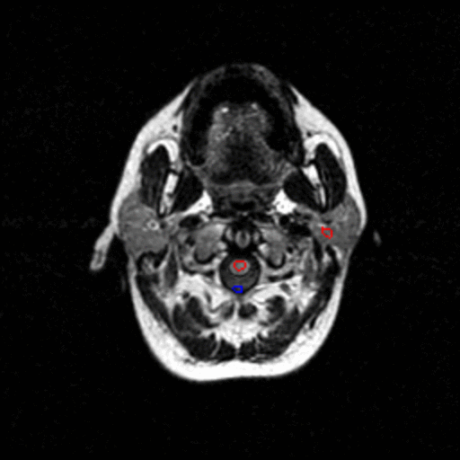

## Deep learning based skull stripping

This folder contains an implementation of our deep learning based skull removal algorithm based on FLAIR modality MRI.
It can be used to preprocess MRI images, train or fine-tune the network for skull stripping or apply it to a custom dataset.

### Results
Some qualitative results for the worst (94.76% DSC) and best case (96.62% DSC) from the test set before postprocessing.
Notice that the reason for suboptimal performance of the deep learning based segmentation (red outline) is that the ground truth (blue outline) is also imperfect since it was generated using another automatic skull stripping tool.

| Worst Case | Best Case |
|:----------:|:---------:|
|||

The average Dice similarity coefficient (DSC) for this split was 95.72%.
The distribution of DCS is shown below.


Training log for a random 5 test cases split:


### Usage

#### Preprocessing
You need to have a folder with images preprocessed using provided matlab function `preprocessing3D.m`.
It rescales them to have spacial dimensions 256x256 and performs contrast normalization.
Refer to the documentation of `preprocessing3D.m` function for more details.
The main requirement for the following steps is to have image names in format `<case_id>_<slice_number>.tif` and corresponding masks named `<case_id>_<slice_number>_mask.tif`.

#### Training
The training script `train.py` has variables defined at the top that you need to set:

- `train_images_path` - folder containing training images
- `valid_images_path` - folder containing validation images
    
Other variables can be changed to adjust some training parameters.
Then, run the training using
```
python train.py
```

#### Testing
To run the inference, you need to set up some variables defined at the top of the `test.py` script:

- `weights_path` - path to the trained weights
- `train_images_path` - folder containing training images to compute the mean and standard deviation for data normalization; if you pass your own mean and standard deviation to the `test` function, this variable is not used
- `test_images_path` - folder with test images for prediction; it must contain corresponding mask files as well, however, they can be dummy (all zeros)
- `predictions_path` - folder for saving predicted and ground truth segmentation outlines (will be created if it doesn't exist)

When all variables are set up, run the inference using
```
python test.py
```

If you want to use our trained weights for inference, you should use mean and standard deviation values for normalization computed on our training set.
They are the default parameter values used in the `test` function of `test.py` script.

Trained weights can be downloaded using provided script
```
./download_weights.sh 
```
